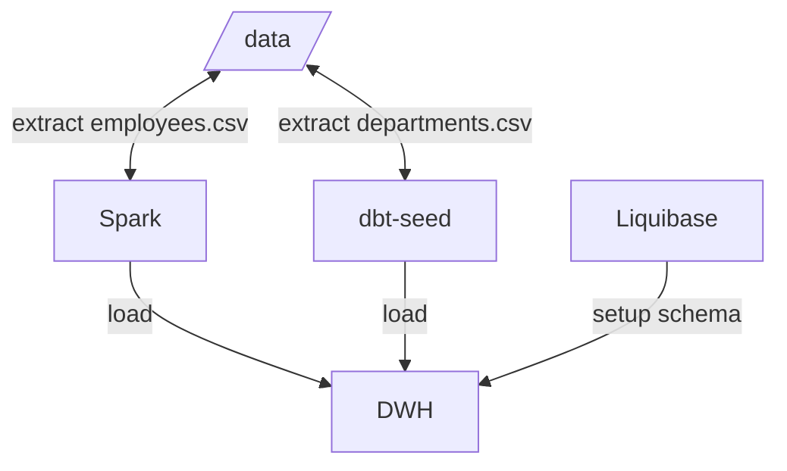
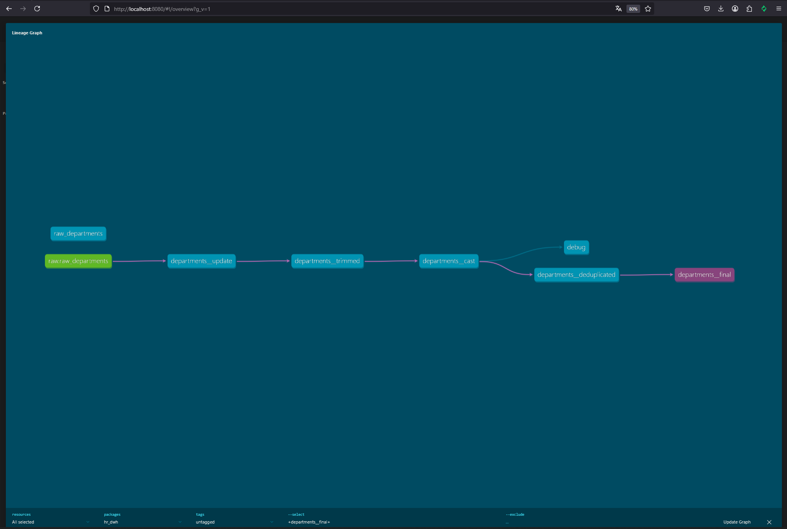
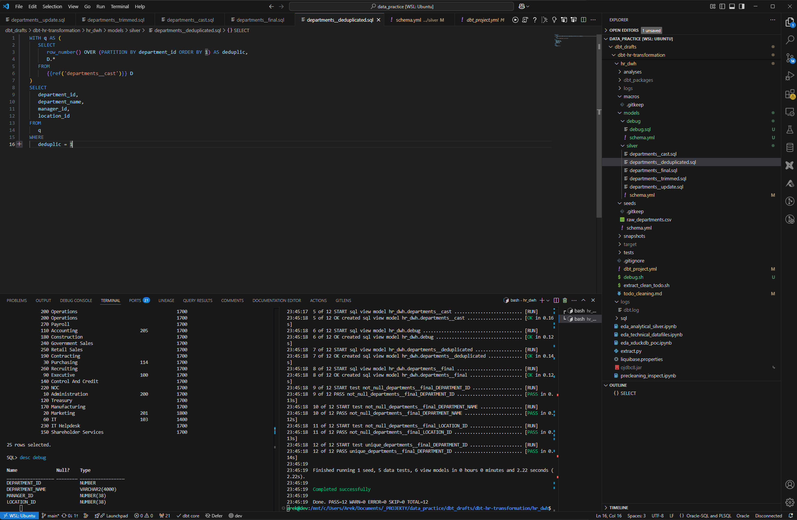

# DBT - hr_dwh

- This is a **proof-of-concept dbt project** for cleaning and transforming HR department data.
- The source data comes from a CSV file. It contains errors, missing values, and messy formatting.  
- This project fixes and prepares the data for analytics or reporting.

## Components: 
- Raw CSV files
- File validation
    - bash scripts
- Schema
    - Liquibase
- Data cleaning
    - raw_departmens.csv -> departments_final
    - dbt, sql, oracle
    - jupiter for precleaning inspect
- Exploratory data analysis 
    - analytical sql, pandas, seaborn
- ELT 
    - spark, airflow

## Flow

## Data architecture
Medalion
- bronze, raw, source of truth or archive
- silver / staging,
    - clean data = prefix stg__*
    - models dim__*, fct__*, int_*
- gold / marts
    - reports, metrics, buissness-ready data

## Transformations - DBT
**DB Credentials**
- /home/arek/.dbt/profiles.yml
**Commands**
- dbt ls --resource-type seed
- dbt serve && dbt serve
- dbt build --select debug.debug --full-refresh

## Liquibase
- liquibase update

## Spark
- spark-submit --jars ojdbc8.jar extract.py

## Gallery

