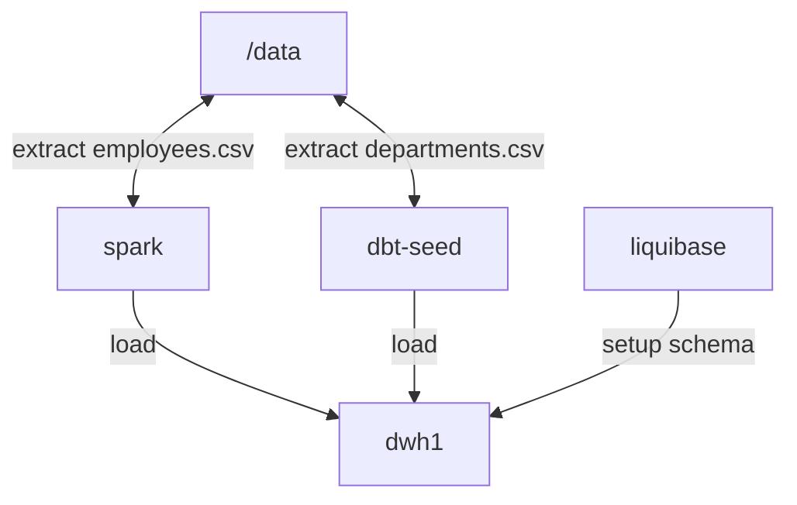

# DBT - hr_dwh
MVP:
- duckdb (eda)
- dbt
- liquibase
- pyspark

## Flow

## Transformations - DBT
**DB Credentials**
/home/arek/.dbt/profiles.yml
**Commands**
dbt ls --resource-type seed

## Database Automations - Liquibse
liquibase update

## Spark
spark-submit --jars ojdbc8.jar extract.py