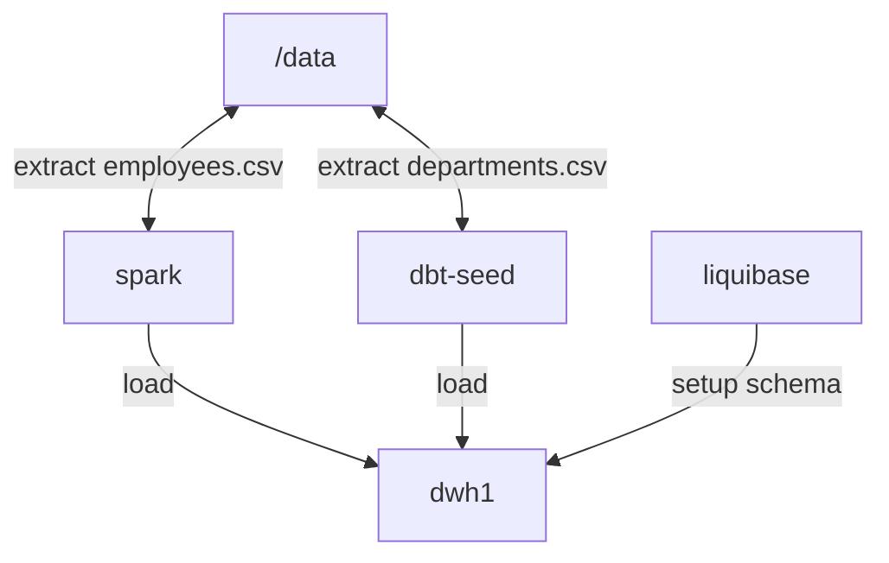

# DBT - hr_dwh
Components: 
- Source CSV files
- File validation, bash
- Model CI/CD, Liquibase
- Data cleaning (sql, pandas)
- Exploratory data analysis (sql, pandas)
- ELT (spark, airflow)

## Flow

## Data architecture
Medalion
- bronze, raw, source of truth or archive
- staging,
    - clean data = prefix stg__*
    - models dim__*, fct__*, int_*
- marts, reports, metrics, buissness-ready data

## Transformations - DBT
**DB Credentials**
/home/arek/.dbt/profiles.yml
**Commands**
dbt ls --resource-type seed

## Database Automations - Liquibse
liquibase update

## Spark
spark-submit --jars ojdbc8.jar extract.py